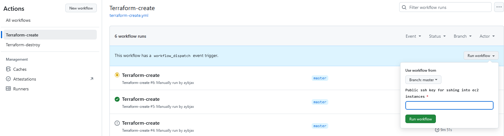

# Task 2: Basic Infrastructure Configuration

## Objective

In this task, you will write Terraform code to configure the basic networking infrastructure required for a Kubernetes (K8s) cluster.

## Description

1. **main.tf**
    - Contains bare terraform object
        - Assumes you have s3 bucket and dynamodb table

2. **compute.tf**
    - Contains 5 ec2 instance resources
        - 1 Bastion EC2
        - 4 with simple server at 8080
    - All contain public key
        - In github action given as input:
            
        - In local provided in terraform.tfvars
            ssh_public_key = "your key"
        - Write private key to bastion ec2 and chmod it as o600
3. **networks.tf**
    - provide:
        - vpc
        - 2 public subnets in two different availability zone
        - 2 private subnets in two different availability zone
        - public route table with internet gateway for connection with internet (in/out)
        - nat gateway with elastic IP for private subnet for outbound connection in private route table
4. **security_groups.tf**
    - provide:
        - bastion security group:
            - allow ssh inbound connection
        - public security group:
            - inbound ssh from bastion sg
            - inbound http:8080 from all connection
                - from each ec2
                - from alb
        - private security group:
            - inbound ssh from bastion sg
            - inbound http:8080 from all connection
                - from each ec2
                - from alb
        - application load balancer (alb) for checking connections
            - all configurations are made
            - for checking
5. **target_groups.tf**
    - provide target groups alb functionality
6. **ssh.tf**
    - ssh public key resource 
7. **variables.tf**
    - all variables used
8. **terraform.tfvars**
    - gitignored
9. **alb.tf**
    - provides public dns as output
    - should load balance between all 4 ec2 instances in 2 AZ and 2 subnets
